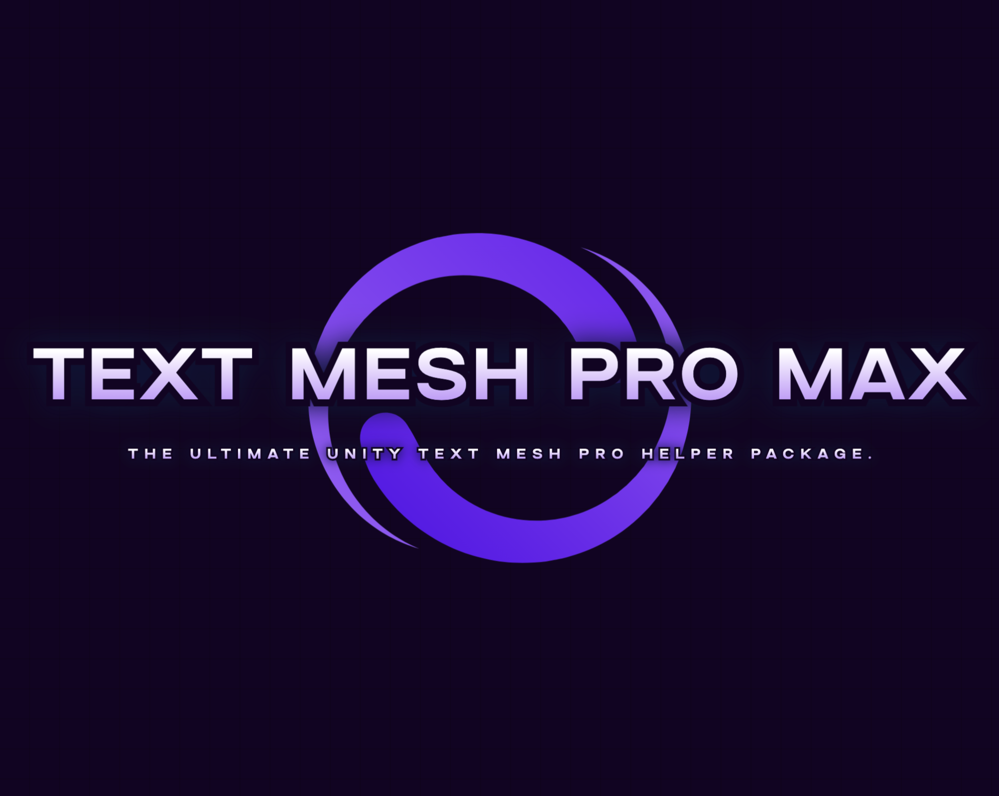
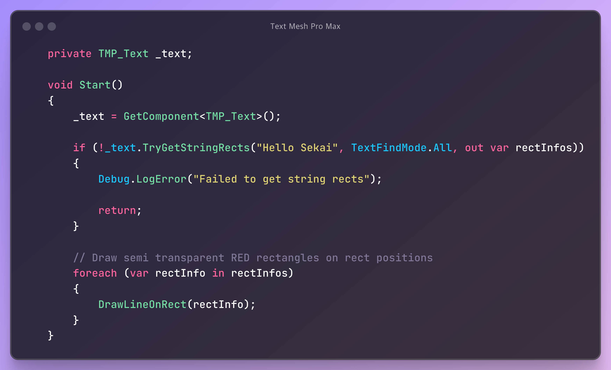
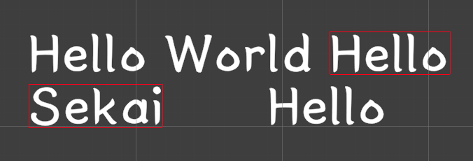
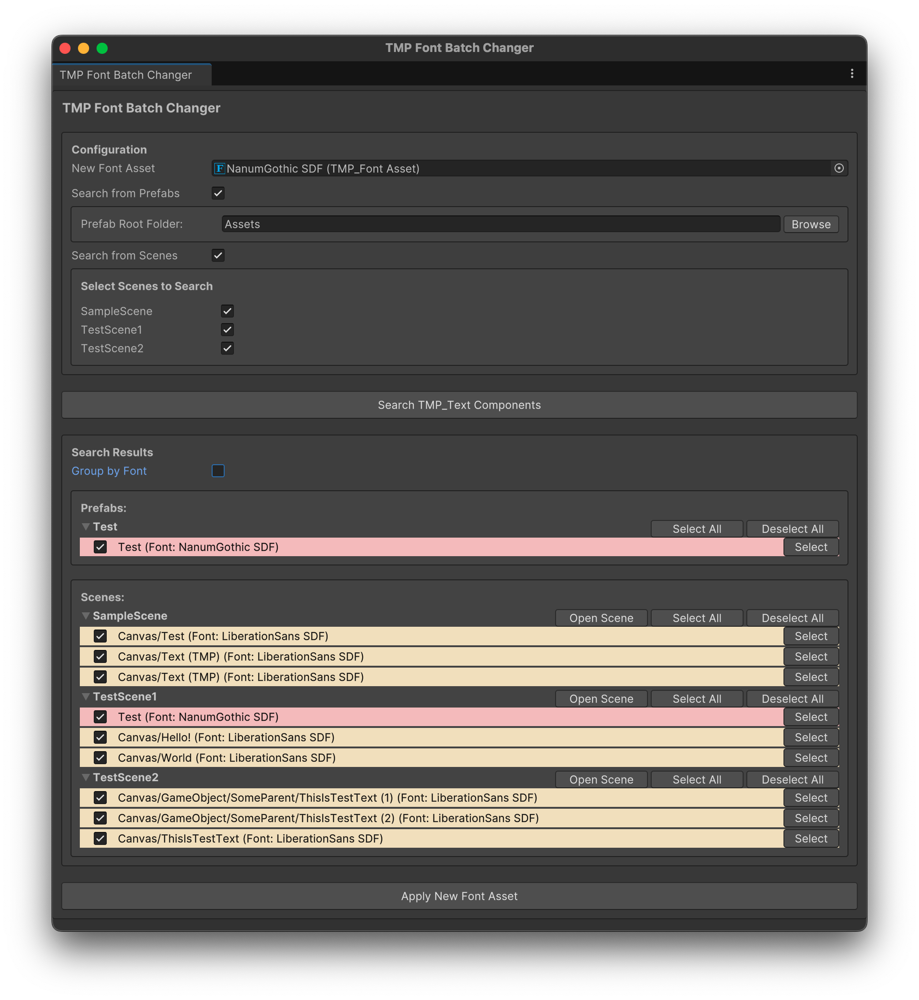
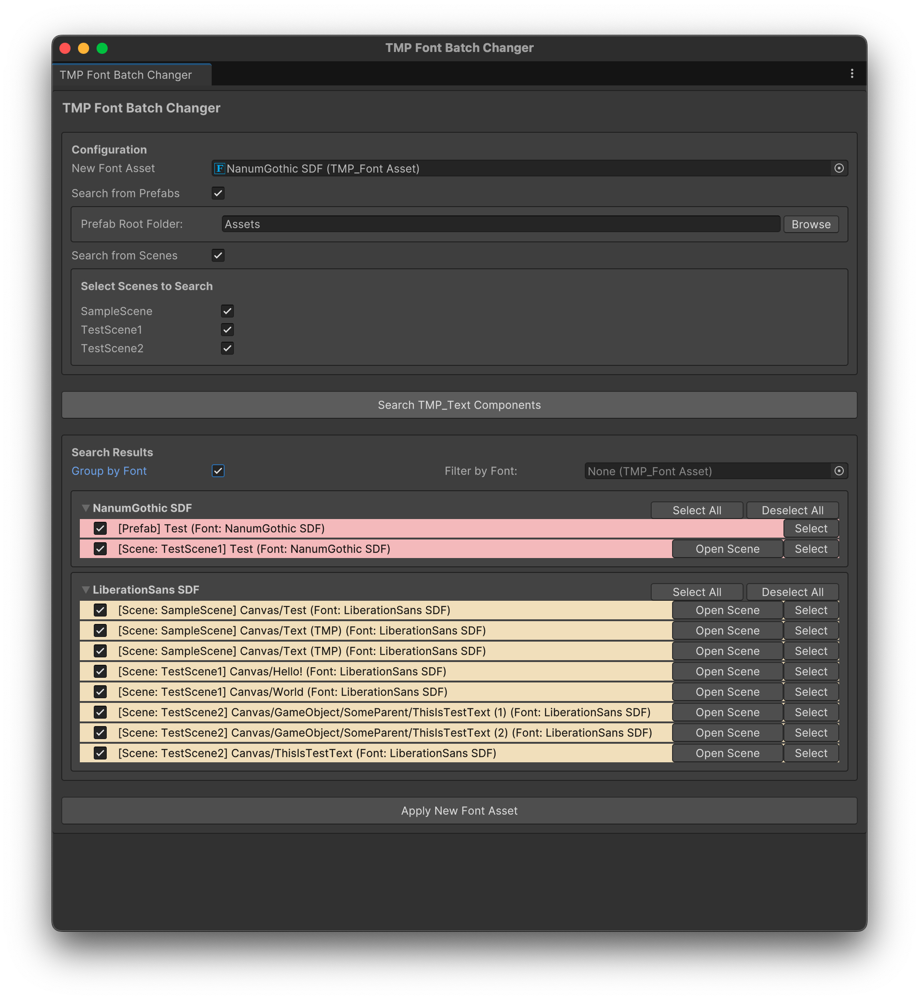
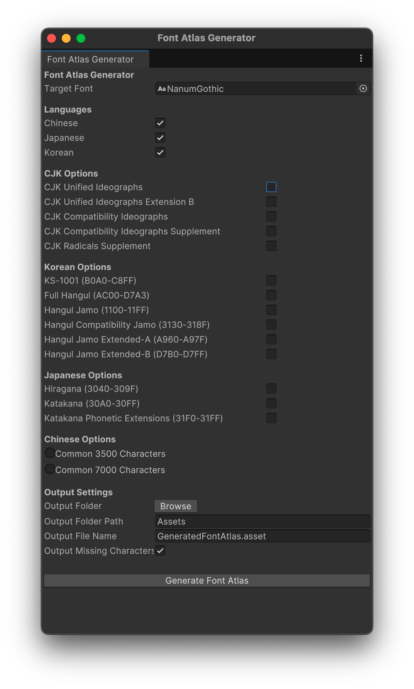

# **TextMeshProMax**


**TextMeshProMax** is a utility library that extends `TextMesh Pro`, making it easier to perform advanced text-related tasks in Unity projects. It supports standard TextMesh Pro functionalities and optional RubyTextMeshPro integration.

------

## Table of Contents
<!-- START doctoc generated TOC please keep comment here to allow auto update -->
<!-- DON'T EDIT THIS SECTION, INSTEAD RE-RUN doctoc TO UPDATE -->
Details

- [Roadmap](#roadmap)
- [How to Install](#how-to-install)
  - [1. Install via OpenUPM](#1-install-via-openupm)
    - [1.1. Install via Package Manager](#11-install-via-package-manager)
    - [1.2. Alternatively, merge the snippet to Packages/manifest.json](#12-alternatively-merge-the-snippet-to-packagesmanifestjson)
    - [1.3. Install via command-line interface](#13-install-via-command-line-interface)
  - [2. Install via Git URL](#2-install-via-git-url)
- [Features](#features)
  - [Helper Features](#helper-features)
    - [1. GetStringRects](#1-getstringrects)
      - [Code Example](#code-example)
    - [1.1 TryGetStringRects](#11-trygetstringrects)
      - [Code Example](#code-example-1)
    - [2. GetRubyStringRects *(Requires RubyTextMeshPro)*](#2-getrubystringrects-requires-rubytextmeshpro)
      - [Parameters](#parameters)
      - [Returns](#returns)
      - [Code Example](#code-example-2)
    - [2.1 TryGetRubyStringRects *(Requires RubyTextMeshPro)*](#21-trygetrubystringrects-requires-rubytextmeshpro)
    - [3. Multi-Line Support](#3-multi-line-support)
      - [Example:](#example)
- [Tools](#tools)
  - [TMP Font Batch Changer](#tmp-font-batch-changer)
    - [How to Use](#how-to-use)
    - [Key Features](#key-features)
  - [CJK Font Atlas Generator](#cjk-font-atlas-generator)
    - [How to Use](#how-to-use-1)
    - [Why Use This Tool?](#why-use-this-tool)
    - [Language Options](#language-options)
    - [CJK Options](#cjk-options)
    - [Detailed Options and Usage](#detailed-options-and-usage)
      - [**Korean**](#korean)
      - [**Japanese**](#japanese)
      - [**Chinese**](#chinese)
    - [**CJK Options**](#cjk-options-1)[README.md](../../../TwentyFiveSlicer/README.md)
- [Contributing](#contributing)
  - [Requesting New Features](#requesting-new-features)
- [License](#license)

<!-- END doctoc generated TOC please keep comment here to allow auto update -->

## Roadmap
You can find the roadmap for this project in the [Roadmap](https://github.com/users/kwan3854/projects/1/views/2) section.

## How to Install

### 1. Install via OpenUPM

#### 1.1. Install via Package Manager
Please follow the instrustions:
- open Edit/Project Settings/Package Manager 
- add a new Scoped Registry (or edit the existing OpenUPM entry)
  - Name: `package.openupm.com`
  - URL: `https://package.openupm.com`
- click `Save` or `Apply`
- open Window/Package Manager 
- click `+`
- select `Add package by name...` or `Add package from git URL...`
- paste `com.kwanjoong.textmeshpromax` into name 
- paste version (e.g.`0.5.2`) into version 
- click `Add`
---
#### 1.2. Alternatively, merge the snippet to Packages/manifest.json
```json
{
  "scopedRegistries": [
    {
      "name": "package.openupm.com",
      "url": "https://package.openupm.com",
      "scopes": []
    }
  ],
  "dependencies": {
    "com.kwanjoong.textmeshpromax": "0.5.2" // Please use the latest version
  }
}
```
#### 1.3. Install via command-line interface
```sh
openupm add com.kwanjoong.textmeshpromax
```

### 2. Install via Git URL
1. Open package manager from **Unity Editor**
  - `Window` -> `Package Manager` -> `+` button on top left -> `Add package from git URL`
2. Copy and paste this url
  - ```https://github.com/kwan3854/TextMeshProMax.git```
  - If you need specific version, you can specify like this ```https://github.com/kwan3854/TextMeshProMax.git#v0.2.0```

> [!TIP]
> You can see inline comments in the code editor by enabling this option in the Unity Editor: `Edit` -> `Preferences` -> `External Tools` -> `Generate .csproj files`
> 

## Features

### Helper Features

#### 1. GetStringRects
Retrieve the **Rect information** for specific strings rendered by a `TMP_Text` object.




- **Parameters**:
  - `text` (`TMP_Text`): The target TextMesh Pro object.
  - `targetString` (`string`): The string you want to locate in the text.
  - `findMode` (`TextFindMode`):
    - `TextFindMode.First`: Returns the first occurrence.
    - `TextFindMode.All`: Returns all occurrences.
- **Returns**:
  - A list of `TextRectInfo` containing `Rects` and the `TargetString`.

##### Code Example
```csharp
using Runtime.Helper;
using TMPro;
using UnityEngine;

public class TMPExample : MonoBehaviour
{
    private TMP_Text _text;

    void Start()
    {
        // Initialize TMP_Text
        _text = GetComponent<TMP_Text>();
        _text.text = "Hello World\nHello Universe";

        // Retrieve Rect information for all occurrences of "Hello"
        var rects = _text.GetStringRects("Hello", TextFindMode.All);

        foreach (var rectInfo in rects)
        {
            foreach (var rect in rectInfo.Rects)
            {
                Debug.Log($"BottomLeft: {rect.min}, TopRight: {rect.max}, String: {rectInfo.TargetString}");
            }
        }
    }
}
```

```csharp
// Works on any tmp: TMP_Text, TextMeshPro, TextMeshProUGUI
TMP_Text text;
TextMeshPro text;
TextMeshProUGUI text;

text.text = "Hello World\nHello Universe";
var rects = text.GetStringRects(rubyString, TextFindMode.All);
```

#### 1.1 TryGetStringRects
Attempt to retrieve the **Rect information** for specific strings rendered by a `TMP_Text` object. Returns `true` if successful, `false` otherwise.

- **Parameters**:
  - Same as `GetStringRects`.
  - Adds `out results` (`List<TextRectInfo>`).
- **Returns**:
  - `bool`: `true` if successful.

##### Code Example
```csharp
List<TextRectInfo> results;
if (text.TryGetStringRects("Hello", TextFindMode.All, out results))
{
    foreach (var rect in results)
    {
        Debug.Log("Rect Found: " + rect);
    }
}
```

#### 2. GetRubyStringRects *(Requires RubyTextMeshPro)*
Retrieve **Rect information** for Ruby strings, including body and Ruby text.

##### Parameters

- `rubyText` (`RubyTextMeshProUGUI` or `RubyTextMeshPro`): The target RubyTextMeshProUGUI object.
- `rubyString` (`RubyString`): A collection of `RubyElement` entries combining Ruby, body, and plain text.
- `findMode`(`TextFindMode`):
  - `TextFindMode.First`: Returns the first occurrence of the Ruby string.
  - `TextFindMode.All`: Returns all occurrences of the Ruby string.

##### Returns

- A list of `TextRectInfo`objects, each containing:
  - `Rects`: A list of `Rect` objects for the string or line.
  - `TargetString`: The concatenated plain text of the Ruby string.

##### Code Example
```csharp
using Runtime.Helper;
using TMPro;
using UnityEngine;

public class RubyTMPExample : MonoBehaviour
{
    private RubyTextMeshProUGUI _text;

    void Start()
    {
        // Initialize RubyTextMeshProUGUI
        _text = GetComponent<RubyTextMeshProUGUI>();
        _text.uneditedText = "<r=domo>Hello</r> <r=sekai>World</r> This is normal text!";

        // Parse RubyTextMeshPro's plain text
        Debug.Log($"PlainText: {_text.GetParsedText()}");

        // Create RubyString
        var rubyString = new RubyString(new List<RubyElement>
        {
            new RubyElement("Hello", "domo"),
            new RubyElement(" "), // Space
            new RubyElement("World", "sekai"),
            new RubyElement(" This is normal text!") // Plain text
        });

        // Retrieve Rect information
        var rects = _text.GetRubyStringRects(rubyString, TextFindMode.All);

        foreach (var rectInfo in rects)
        {
            foreach (var rect in rectInfo.Rects)
            {
                Debug.Log($"BottomLeft: {rect.min}, TopRight: {rect.max}, String: {rectInfo.TargetString}");
            }
        }
    }
}
```

```csharp
// Works on both RubyTextMeshPro(3D text) and RubyTextMeshProUGUI(2D UI text)
RubyTextMeshProUGUI text;
RubyTextMeshPro text;

text.uneditedText = "<r=domo>Hello</r> <r=sekai>World</r> This is normal text!";
var rects = text.GetRubyStringRects(rubyString, TextFindMode.All);
```

#### 2.1 TryGetRubyStringRects *(Requires RubyTextMeshPro)*
Attempt to retrieve the **Rect information** for complex Ruby strings rendered by a `RubyTextMeshProUGUI` object. Returns `true` if successful, `false` otherwise.

#### 3. Multi-Line Support
The library can calculate `Rect` values for text that spans multiple lines. Whether the line breaks are due to manual newlines (`\n`) or automatic text wrapping applied by TextMesh Pro, the library handles them seamlessly.

> [!TIP]
> If the target string crosses line boundaries, the library automatically splits the result into one `Rect` per line, regardless of whether the line break was introduced manually or by automatic word wrapping.

##### Example:

For the text:

```
Hello
World!
```

If the target string is `"Hello\nWorld!"`, the result will include two `Rect` objects:

- One for `"Hello"`
- One for `"World!"`

For the text:

```
Hello very long
text that wraps!
```

If the target string is `"Hello very long text that wraps!"`, the result will include two `Rect` objects:

- One for `"Hello very long"`
- One for `"text that wraps!"`


---

## Tools

### TMP Font Batch Changer

The **TMP Font Batch Changer** automates the process of finding and replacing fonts across scenes and prefabs.
> [!CAUTION]
> Always back up your project before performing bulk operations. We do not guarantee compensation for any damage or loss caused by using this tool.




#### How to Use
1. Open the tool:
   - `Tools` -> `TextMeshPro Max` -> `TMP Font Batch Changer`
2. Set up:
   - **New Font Asset**: Font to apply.
   - **Prefab Root Folder**: Folder to search for prefabs.
   - **Scene Selection**: Select scenes to scan.
3. Click **Search TMP_Text Components**.
4. Review and apply changes.

> [!TIP]
> You can ping the TMP_Text component in the scene/project by clicking the **Select** button.

#### Key Features
- **Group by Font**: Organize TMP_Text components by their current fonts.
- **Scene and Prefab Support**: Apply font changes across your project.
- **Manual Review**: Toggle components to selectively update.

---

### CJK Font Atlas Generator

The **CJK TextBakerProMax** is a utility for creating customized TextMesh Pro font atlases optimized for CJK (Chinese, Japanese, Korean) characters. It generates **Dynamic Atlases**, ensuring text rendering flexibility without pre-baking static font assets.

#### How to Use
1. Open the tool:
  - `Tools` -> `TextMeshPro Max` -> `CJK Font Atlas Generator`
    
> [!WARNING]
> Disable the "Clear Dynamic Data On Build" option to retain character atlases in builds. This option is located in inspector of the generated font asset. (or in the TMP Settings for all fonts)

#### Why Use This Tool?
By default, dynamic font atlases in TextMesh Pro allow you to use fonts without worrying about missing characters. Characters are added to the atlas dynamically as needed. However, there are specific cases where you might want to predefine a set of characters in the atlas to avoid runtime performance issues:

1. **High-density text rendering**: For example, chat applications, subtitles, or text-rich interfaces where a large number of characters are displayed at once.
2. **Unpredictable character usage**: For example, when text is dynamically loaded from servers or large datasets, and the exact characters are unknown at build time.

For most projects, especially where the text is predictable and limited in quantity, you don’t need to predefine a large set of characters. Instead, rely on the default dynamic behavior to optimize performance.


#### Language Options
You can select from **Chinese**, **Japanese**, and **Korean**. These options determine which specific ranges and subsets of characters will be included in the generated font atlas.

#### CJK Options
These options are shared across all three languages. They cover additional character sets commonly used in CJK writing systems. The following sections provide detailed descriptions of each range, their purpose, and when to enable them.

---

#### Detailed Options and Usage

##### **Korean**
1. **KS-1001 (B0A0-C8FF)**
   - **Description**:  
     KS X 1001 is the South Korean character encoding standard. It includes 2,350 commonly used Hangul syllables, Hanja, and symbols.  
     [Learn more about KS X 1001](https://en.wikipedia.org/wiki/KS_X_1001)
   - **When to Enable**:  
     Use this option if your project targets South Korean audiences and focuses on frequently used characters (e.g., educational apps, simple interfaces).

2. **Full Hangul (AC00-D7A3)**
   - **Description**:  
     This range includes all 11,172 possible Hangul syllables, covering every valid combination of Korean Jamo.
   - **When to Enable**:  
     Use for applications that involve extensive Korean text or unpredictable user input, such as chat apps or text-heavy games.

3. **Hangul Jamo (1100-11FF)**
   - **Description**:  
     Includes the individual components (consonants and vowels) used to form Hangul syllables.
   - **When to Enable**:  
     Choose this if your project involves advanced Korean typography or phonetic analysis, where Jamo might be displayed independently.

4. **Hangul Compatibility Jamo (3130-318F)**
   - **Description**:  
     Contains pre-composed Hangul Jamo blocks for backward compatibility.
   - **When to Enable**:  
     Use only if your application needs to support legacy Korean text encoding.

5. **Hangul Jamo Extended-A (A960-A97F)**
   - **Description**:  
     Additional Jamo blocks introduced in Unicode 5.2.
   - **When to Enable**:  
     Enable for specialized linguistic tools or projects requiring modern Korean typographic features.

6. **Hangul Jamo Extended-B (D7B0-D7FF)**
   - **Description**:  
     A further extension of Hangul Jamo for rare or historic Korean text.
   - **When to Enable**:  
     Enable only if you are working on historic Korean text or rare linguistic projects.

---

##### **Japanese**
1. **Hiragana (3040-309F)**
   - **Description**:  
     The basic phonetic script used in Japanese. Includes 83 characters.  
     [Learn more about Hiragana](https://en.wikipedia.org/wiki/Hiragana)
   - **When to Enable**:  
     Use for any Japanese text rendering, as Hiragana is fundamental to the language.

2. **Katakana (30A0-30FF)**
   - **Description**:  
     The second phonetic script in Japanese, used for foreign words and emphasis. Includes 96 characters.  
     [Learn more about Katakana](https://en.wikipedia.org/wiki/Katakana)
   - **When to Enable**:  
     Essential for Japanese text, especially in games or apps with foreign word integration or stylized text.

3. **Katakana Phonetic Extensions (31F0-31FF)**
   - **Description**:  
     Extensions to Katakana, mainly for Ainu language support.
   - **When to Enable**:  
     Use for projects involving Ainu language support or specialized Japanese typographic needs.

---

##### **Chinese**
1. **Common 3500 Characters**
   - **Description**:  
     A curated set of 3,500 frequently used Chinese characters, covering most everyday text.  
     [Learn more about Common 3500 Characters](https://github.com/wy-luke/Unity-TextMeshPro-Chinese-Characters-Set/blob/main/3500%E6%B1%89%E5%AD%97%2B%E7%AC%A6%E5%8F%B7%2B%E8%8B%B1%E6%96%87%E5%AD%97%E7%AC%A6%E9%9B%86.txt)
   - **When to Enable**:  
     Use for general-purpose Chinese text rendering.

2. **Common 7000 Characters**
   - **Description**:  
     An extended set of 7,000 Chinese characters, including less common or specialized characters.  
     [Learn more about Common 7000 Characters](https://github.com/wy-luke/Unity-TextMeshPro-Chinese-Characters-Set/blob/main/7000%E6%B1%89%E5%AD%97%2B%E7%AC%A6%E5%8F%B7%2B%E8%8B%B1%E6%96%87%E5%AD%97%E7%AC%A6%E9%9B%86.txt)
   - **When to Enable**:  
     Use for projects requiring a broader range of Chinese characters, such as educational apps or specialized text processing.

#### **CJK Options**
1. **CJK Unified Ideographs (4E00-9FBF)**
   - **Description**:  
     The core block of 20,976 Chinese, Japanese, and Korean ideographs.  
     [Learn more about CJK Unified Ideographs](https://en.wikipedia.org/wiki/CJK_Unified_Ideographs)
   - **When to Enable**:  
     Use this for general-purpose support of Chinese, Japanese, or Korean text. Essential for any CJK-focused application.

2. **CJK Unified Ideographs Extension B (20000-2A6DF)**
   - **Description**:  
     Includes 42,711 additional ideographs.  
     [Learn more about Extension B](https://en.wikipedia.org/wiki/CJK_Unified_Ideographs_Extension_B)
   - **When to Enable**:  
     Use for scholarly or historic texts requiring rare or ancient characters.

3. **CJK Compatibility Ideographs (F900-FAFF)**
   - **Description**:  
     A set of characters for compatibility with legacy encodings.  
     [Learn more about CJK Compatibility Ideographs](https://en.wikipedia.org/wiki/CJK_Compatibility_Ideographs)
   - **When to Enable**:  
     Use only for backward compatibility or applications handling legacy text files.

4. **CJK Compatibility Ideographs Supplement (2F800-2FA1F)**
   - **Description**:  
     Supplements the compatibility ideographs for specialized needs.  
     [Learn more about the Supplement](https://en.wikipedia.org/wiki/CJK_Compatibility_Ideographs_Supplement)
   - **When to Enable**:  
     Enable for rare cases involving historic or specialized text processing.

5. **CJK Radicals Supplement (2E80-2EFF)**
   - **Description**:  
     Contains radicals used in East Asian scripts for dictionaries or indexing.  
     [Learn more about CJK Radicals Supplement](https://en.wikipedia.org/wiki/CJK_Radicals_Supplement)
   - **When to Enable**:  
     Use for dictionary applications or tools involving radical-based text analysis.

---

## Contributing
We welcome contributions to this project. If you have ideas for new features or improvements, feel free to open an issue or submit a pull request.

### Requesting New Features
If you want to request a new feature or report a bug, please visit the [Issues](https://github.com/kwan3854/TextMeshProMax/issues) page of the repository and create a new issue.

## License
This project is licensed under the MIT License. See the LICENSE file for details.
